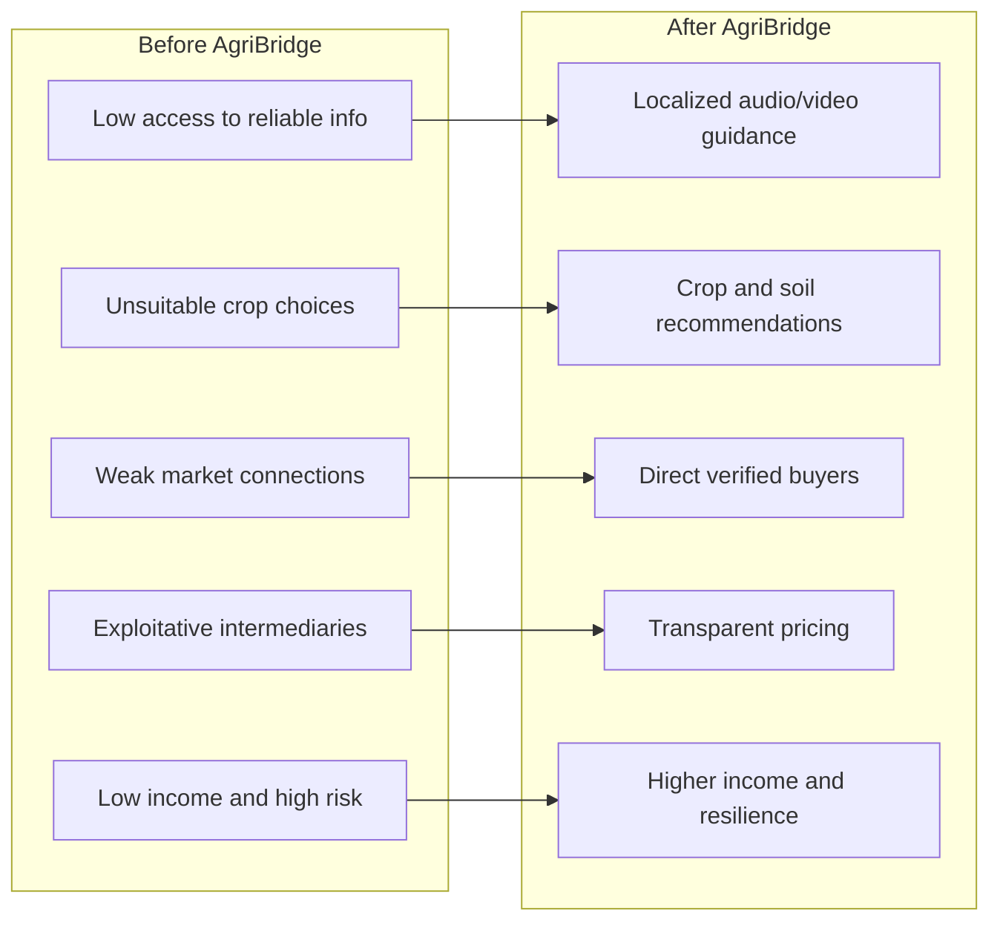
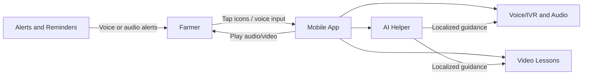
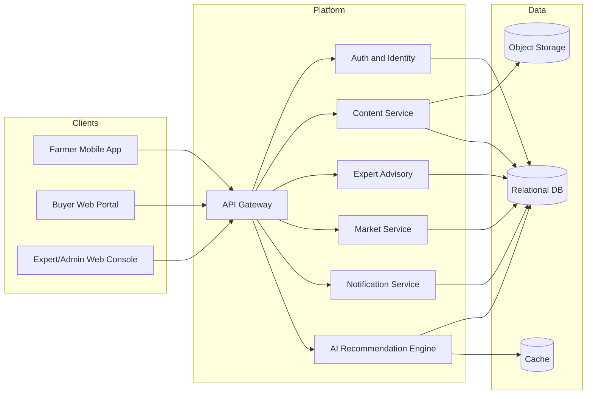
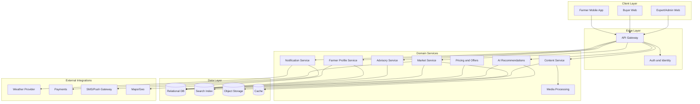

# AgriBridge (Farmer_with_Market)

Smart, mobile-first platform that connects smallholder farmers to practical knowledge and verified markets.

```
	 _
 _( )_                     .-""-.
(_   _)                   / .--. \
	| |                    / /    \ \
	| |       .-""-.       | |    | |
	| |      / .--. \      | |    | |
	| |     / /    \ \     | |    | |
	| |     | |    | |     | |    | |
	|_|     \ \    / /      \ \__/ /
	 ( )     \ '--' /        '----'
		\ \     '-..-'        / .--. \
		 \ \                / /    \ \
			\ \              | |    | |
			 \ \             | |    | |
				\ \            | |    | |
				 \ \            \ \__/ /
					\ \            '----'
					 \ \      Farmer with Market
						\ \
						 \ \
							\_\

	 Fruit Basket          Livestock
			.-""-.               /\_/\
		 / .--. \             ( o.o )
		/ /    \ \             > ^ <
		| |    | |             /| |\
		\ \    / /            /_| |_\
		 \ '--' /            /__|__\
			'-..-'
```

## Table of Contents

- [About](#about)
- [Animation](#animation)
- [Project Description](#project-description)
- [Problem Statement](#problem-statement)
- [Before and After](#before-and-after)
- [Objectives and Goals](#objectives-and-goals)
- [Target Users](#target-users)
- [Key Features](#key-features)
- [Low-Literacy Access](#low-literacy-access)
- [Tech Stack](#tech-stack)
- [System Architecture](#system-architecture)
- [Detailed Architecture](#detailed-architecture)
- [Design Architecture](#design-architecture)
- [Farmer-System Relationship](#farmer-system-relationship)
- [Farmer-Market Connection](#farmer-market-connection)
- [Core Modules](#core-modules)
- [Use Cases](#use-cases)
- [Sequence Flows](#sequence-flows)
- [Data Model](#data-model)
- [Design](#design)
- [Getting Started](#getting-started)
- [Non-Functional Requirements](#non-functional-requirements)
- [Scope and Roadmap](#scope-and-roadmap)
- [Expected Impact](#expected-impact)
- [Alignment with Global Goals](#alignment-with-global-goals)
- [Contributing](#contributing)
- [License](#license)

## About

AgriBridge is a smart, mobile-based platform designed to support smallholder farmers by providing easy-to-understand agricultural information and direct access to markets. The platform delivers guidance on crops, livestock, soil conditions, and climate using audio and video in local languages, making it accessible to farmers with low literacy levels.

AgriBridge also connects farmers with agricultural experts and verified buyers, enabling fair, efficient product sales. This bridges the gap between knowledge, production, and market access.

## Animation


## Project Description

AgriBridge combines farmer profiles, advisory services, and market tools into one mobile-first experience. Farmers can learn with audio and video, ask experts for guidance, and list produce for verified buyers. The platform emphasizes low data usage, offline-friendly access, and trusted transactions to improve yields, reduce risk, and increase income.

## Problem Statement

Farmers in rural areas face major challenges:

- Lack of reliable agricultural information (soil, crops, climate)
- Poor awareness of crop suitability
- Limited access to modern farming practices
- Weak connections to trusted markets
- Exploitation by illegal traders and intermediaries
- Low income despite high effort

These issues lead to crop failure, financial loss, and food insecurity.

## Before and After

How the farmer experience changes after using AgriBridge.



## Objectives and Goals

**General objective**: Empower farmers with accessible knowledge and direct market connections to improve productivity and income.

**Specific objectives**:

- Provide simple, localized agricultural education
- Enable data-driven farming decisions
- Connect farmers to verified markets and buyers
- Reduce exploitation by intermediaries
- Improve product quality and income levels

**Goals**:

| Horizon                 | Goals                                                                                            |
| ----------------------- | ------------------------------------------------------------------------------------------------ |
| Short-Term (4-6 months) | Pilot with 500-1,000 farmers, run training sessions, test AI recommendations and market features |
| Long-Term               | Scale to 4,000,000+ farmers, expand languages, build nationwide farmer-market ecosystem          |

## Target Users

- Smallholder farmers in rural areas
- Low-literacy farmers
- Farmers lacking access to experts and markets

## Key Features

- Mobile-friendly platform (low data usage)
- Audio-based learning for accessibility
- Video tutorials for practical guidance
- Climate and weather updates
- Crop and soil recommendations
- Direct access to agricultural experts
- Market connection system
- Product listing and promotion tools

## Low-Literacy Access

How the platform supports farmers who cannot read or write through audio and video guidance.



## Tech Stack

This section will be finalized once the implementation stack is confirmed. Proposed placeholders:

| Layer      | Candidate Options                            |
| ---------- | -------------------------------------------- |
| Mobile App | Flutter or React Native                      |
| Web        | React or Vue                                 |
| Backend    | Node.js (Express) or Django                  |
| Database   | PostgreSQL                                   |
| Storage    | S3-compatible object storage                 |
| AI/ML      | Python services (recommendations, NLP/voice) |
| Messaging  | Firebase, Twilio, or local SMS gateways      |

## System Architecture

AgriBridge combines mobile and web clients with a scalable backend and AI services.



## Detailed Architecture

Deeper view of services, integrations, and data flows.



## Design Architecture

User experience flow and system responsibilities at each step.

```mermaid
sequenceDiagram
	participant Farmer
	participant App
	participant Gateway
	participant Services
	participant Data
	participant Market

	Farmer->>App: Open app and select task
	App->>Gateway: Request feature entry
	Gateway->>Services: Route to relevant module
	Services->>Data: Fetch/update records
	Services->>Market: Match listing with buyers
